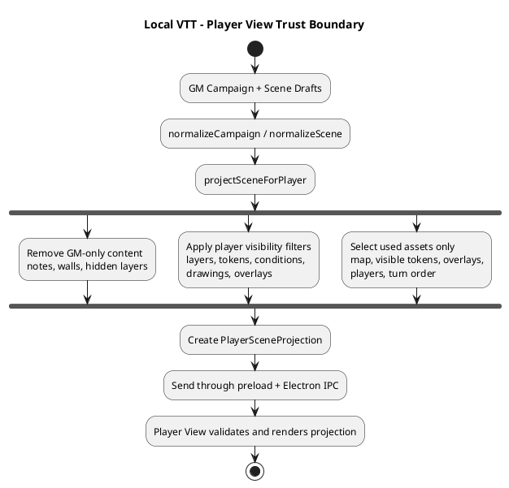
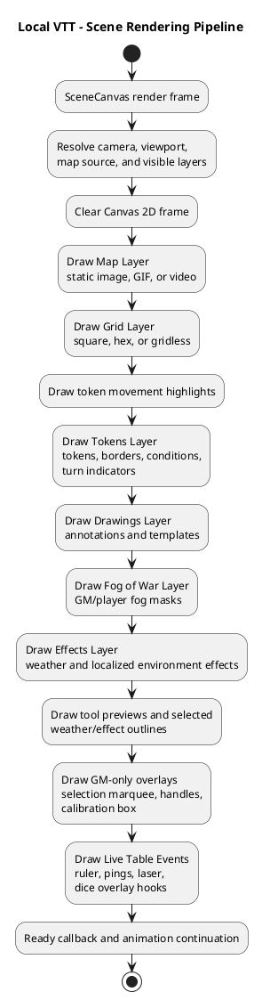
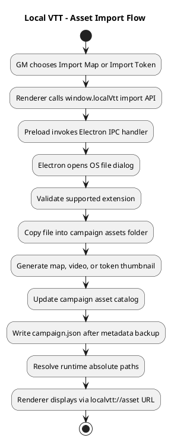
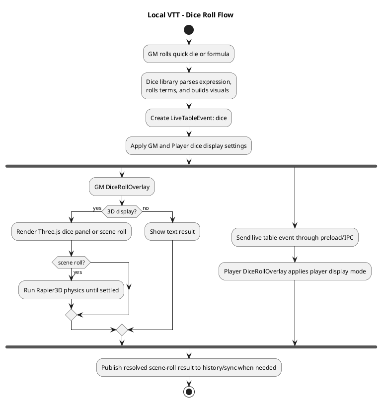
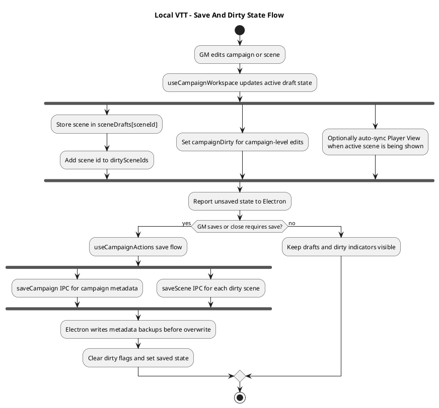

# Local VTT PlantUML Diagrams

These versions use the C4-PlantUML standard library. Most online PlantUML renderers can load the `!includeurl` references directly; if one blocks remote includes, paste the referenced C4-PlantUML file contents into the diagram first.

Architecture baseline: Local VTT `0.1.12`.

## System Context

```plantuml
@startuml
!includeurl https://raw.githubusercontent.com/plantuml-stdlib/C4-PlantUML/master/C4_Context.puml

title Local VTT - System Context

Person(gm, "Game Master", "Creates and runs local tabletop scenes from the private GM View.")
Person(players, "Players", "View the projected battle map on a TV, monitor, or projector.")

System_Boundary(localMachine, "GM's Local Computer") {
  System(localVtt, "Local VTT", "Local-first desktop virtual tabletop for in-person RPG sessions.")
  System_Ext(desktopOs, "Desktop OS", "Windowing, display enumeration, file dialogs, fullscreen, and filesystem access.")
  System_Ext(campaignFolder, "Portable Campaign Folder", "campaign.json, scene JSON, imported assets, thumbnails, and metadata backups.")
  System_Ext(sourceMedia, "Source Media Files", "Imported maps, videos, token images, overlays, effects, and handouts.")
}

Rel(gm, localVtt, "Runs sessions, edits scenes, imports assets, opens Player View")
Rel(players, localVtt, "Watch projected scenes and live table events")
Rel(localVtt, desktopOs, "Uses Electron/Chromium desktop APIs")
Rel(localVtt, campaignFolder, "Reads and writes local campaign data")
Rel(localVtt, sourceMedia, "Imports selected local files into campaign assets")

Lay_R(gm, localVtt)
Lay_R(localVtt, players)
Lay_D(localVtt, desktopOs)
Lay_D(localVtt, campaignFolder)
Lay_D(localVtt, sourceMedia)

SHOW_LEGEND()
@enduml
```

## Container Diagram

```plantuml
@startuml
!includeurl https://raw.githubusercontent.com/plantuml-stdlib/C4-PlantUML/master/C4_Container.puml

title Local VTT - Containers

Person(gm, "Game Master", "Controls the session from the GM window.")
Person(players, "Players", "See the projected Player View.")

System_Boundary(localVtt, "Local VTT Desktop App") {
  Container(gmRenderer, "GM View Renderer", "React, Canvas 2D, Three.js, Vite", "Private control UI for campaigns, scenes, tools, layers, dice, turn order, and canvas editing.")
  Container(playerRenderer, "Player View Renderer", "React, Canvas 2D, Three.js", "Filtered, non-interactive scene projection for external displays.")
  Container(preloadBridge, "Preload Bridge", "Electron contextBridge", "Typed window.localVtt API that exposes only approved IPC operations to renderer code.")
  Container(electronMain, "Electron Main Process", "Electron, Node.js", "Owns app lifecycle, secure windows, IPC handlers, filesystem IO, asset import, backups, custom asset protocol, and Player View control.")
  Container(sharedModel, "Shared Model and Projection", "TypeScript", "Campaign and scene schemas, defaults, validation, normalization, migrations, and player-safe projection.")
}

ContainerDb(campaignFolder, "Campaign Folder", "JSON and media files", "Portable local folder with campaign metadata, scene files, assets, thumbnails, and backups.")
System_Ext(desktopOs, "Desktop OS", "Displays, dialogs, shell, fullscreen, filesystem, and Chromium media decoding.")

Rel(gm, gmRenderer, "Uses")
Rel(players, playerRenderer, "Views")
Rel(gmRenderer, preloadBridge, "Calls typed API", "window.localVtt")
Rel(playerRenderer, preloadBridge, "Subscribes to player state and live table events", "window.localVtt")
Rel(preloadBridge, electronMain, "Invokes handlers and receives events", "Electron IPC")
Rel(gmRenderer, sharedModel, "Uses schemas, defaults, normalization, and projection helpers")
Rel(playerRenderer, sharedModel, "Validates projected scenes and live table events")
Rel(electronMain, sharedModel, "Validates, normalizes, and serializes campaign data")
Rel(electronMain, campaignFolder, "Reads, writes, imports, backs up, and deletes")
Rel(electronMain, desktopOs, "Creates windows, opens dialogs, enumerates displays, opens folders")
Rel(electronMain, playerRenderer, "Sends projected scene state and live table events", "IPC")

Lay_R(gm, gmRenderer)
Lay_R(playerRenderer, players)
Lay_D(gmRenderer, preloadBridge)
Lay_D(playerRenderer, preloadBridge)
Lay_R(preloadBridge, electronMain)
Lay_D(electronMain, campaignFolder)
Lay_R(electronMain, desktopOs)

SHOW_LEGEND()
@enduml
```

## Renderer Component Diagram

```plantuml
@startuml
!includeurl https://raw.githubusercontent.com/plantuml-stdlib/C4-PlantUML/master/C4_Component.puml

title Local VTT - Renderer Components

Container_Boundary(renderer, "src/renderer") {
  Component(routeBootstrap, "Renderer Bootstrap", "main.tsx", "Chooses GM or Player app from the hash route and installs renderer error reporting.")
  Component(gmApp, "GM App", "React", "Coordinates workspace state, scene tools, dialogs, layer panels, token library, dice, turn order, and Player View controls.")
  Component(playerApp, "Player App", "React", "Receives player state, manages scene transitions, idle screens, fullscreen escape, and player dice overlays.")
  Component(sceneCanvas, "Scene Canvas", "React + Canvas 2D", "Renders maps, grids, fog, weather, effects, drawings, tokens, measurement, selection, and live table events.")
  Component(campaignWorkspace, "Campaign Workspace Hook", "React hooks", "Tracks active campaign, active scene, dirty drafts, save state, errors, and Player View sync.")
  Component(playerViewLib, "Player View Library", "TypeScript", "Builds player-safe projections and sends scene, idle, dice, ping, and laser events through the preload API.")
  Component(canvasModules, "Canvas Modules", "TypeScript", "Map, grid, scene, fog, effects, weather, drawings, tokens, selection, measurement, and live-table renderers.")
  Component(domainLibs, "Domain Libraries", "TypeScript", "Campaign actions, assets, dice, map calibration, scene editing, token defaults, turn order, workspace layout, and UI helpers.")
}

Container(preloadBridge, "Preload Bridge", "Electron contextBridge", "Typed window.localVtt API.")
Container(sharedModel, "Shared Model and Projection", "TypeScript", "Schemas, defaults, validation, normalization, and player projection.")

Rel(routeBootstrap, gmApp, "Mounts for #/gm")
Rel(routeBootstrap, playerApp, "Mounts for #/player")
Rel(gmApp, campaignWorkspace, "Reads and updates workspace state")
Rel(gmApp, sceneCanvas, "Passes editable scene state, tools, selections, and callbacks")
Rel(playerApp, sceneCanvas, "Passes projected scene state in non-interactive mode")
Rel(gmApp, domainLibs, "Uses feature logic")
Rel(sceneCanvas, canvasModules, "Delegates rendering, hit testing, snapping, geometry, and interaction")
Rel(campaignWorkspace, playerViewLib, "Auto-syncs active Player View")
Rel(playerViewLib, sharedModel, "Calls projectSceneForPlayer")
Rel(gmApp, preloadBridge, "Creates, opens, saves, imports, and controls Player View")
Rel(playerApp, preloadBridge, "Receives player state and live table events")
Rel(domainLibs, sharedModel, "Uses shared types and defaults")

Lay_R(routeBootstrap, gmApp)
Lay_D(gmApp, sceneCanvas)
Lay_D(playerApp, sceneCanvas)
Lay_R(gmApp, campaignWorkspace)
Lay_D(campaignWorkspace, playerViewLib)
Lay_R(sceneCanvas, canvasModules)
Lay_D(gmApp, domainLibs)
Lay_R(playerViewLib, sharedModel)
Lay_D(gmApp, preloadBridge)

SHOW_LEGEND()
@enduml
```

## Three.js And Rapier3D Usage

```plantuml
@startuml
!includeurl https://raw.githubusercontent.com/plantuml-stdlib/C4-PlantUML/master/C4_Component.puml

title Local VTT - Three.js and Rapier3D Usage

Container_Boundary(renderer, "src/renderer") {
  Component(sceneCanvas, "Scene Canvas", "React + Canvas 2D", "Primary map renderer that composites maps, grid, fog, effects, drawings, tokens, measurements, and live table events.")
  Component(diceOverlay, "Dice Roll Overlay", "React + Three.js + Rapier3D", "Renders 3D dice panels and scene rolls. Scene rolls use Rapier3D physics before publishing the resolved result.")
  Component(weatherRenderers, "Weather Renderers", "Three.js WebGLRenderer", "Rain, fog, snow, and sand renderers draw WebGL particles, meshes, and shader effects into the 2D canvas flow.")
  Component(environmentEffects, "Environment Effects Renderer", "Three.js shaders", "Renders localized animated effects such as water, lava, smoke, fire, fog, lightning, arcane, radiant, force fields, and related masks.")
  Component(templateTextures, "Template Effect Assets", "Transient Three.js WebGLRenderer", "Generates reusable bitmap-like spell/template visuals that are cached and composited by the drawing renderer.")
}

Component(threeJs, "Three.js", "WebGL rendering library", "Meshes, particles, shaders, cameras, lighting, geometry, materials, textures, and shared dice WebGL renderer.")
Component(rapier3d, "Rapier3D", "Physics engine", "Rigid bodies, colliders, gravity, bounces, settling, and resolved face orientation for scene-style dice rolls.")
Component(canvas2d, "Canvas 2D Context", "Browser rendering API", "Final map-bound composition target for the scene canvas.")

Rel(sceneCanvas, diceOverlay, "Shows dice overlays and scene roll results through live table events")
Rel(sceneCanvas, weatherRenderers, "Calls drawWeather during scene rendering")
Rel(sceneCanvas, environmentEffects, "Draws localized animated effect layer")
Rel(sceneCanvas, templateTextures, "Uses cached template visuals through drawing rendering")
Rel(diceOverlay, threeJs, "Creates dice scene, camera, lights, meshes, labels, highlights, and renderer")
Rel(diceOverlay, rapier3d, "Uses physics only for scene roll mode")
Rel(weatherRenderers, threeJs, "Creates WebGL renderers, orthographic cameras, particles, meshes, and shader materials")
Rel(environmentEffects, threeJs, "Creates effect meshes, shader materials, uniforms, and animated render targets")
Rel(templateTextures, threeJs, "Creates transient renderers, scenes, cameras, and texture snapshots")
Rel(weatherRenderers, canvas2d, "Composites rendered weather into map canvas")
Rel(environmentEffects, canvas2d, "Composites animated effects into map canvas")
Rel(templateTextures, canvas2d, "Draws cached template images into drawing layer")

Lay_D(sceneCanvas, diceOverlay)
Lay_D(sceneCanvas, weatherRenderers)
Lay_D(sceneCanvas, environmentEffects)
Lay_D(sceneCanvas, templateTextures)
Lay_R(diceOverlay, threeJs)
Lay_R(diceOverlay, rapier3d)
Lay_R(weatherRenderers, threeJs)
Lay_R(environmentEffects, threeJs)
Lay_R(templateTextures, canvas2d)

SHOW_LEGEND()
@enduml
```

## Electron Component Diagram

```plantuml
@startuml
!includeurl https://raw.githubusercontent.com/plantuml-stdlib/C4-PlantUML/master/C4_Component.puml

title Local VTT - Electron Main Components

Container_Boundary(electron, "electron/") {
  Component(mainProcess, "Main Process", "main.ts", "Application lifecycle, secure BrowserWindow creation, IPC registration, Player View window control, and unsaved-close handling.")
  Component(preload, "Preload API", "preload.ts", "contextBridge wrapper around approved ipcRenderer.invoke, ipcRenderer.send, and event subscriptions.")
  Component(persistenceCodecs, "Persistence Codecs", "persistenceCodecs.ts", "Parse and serialize portable campaign and scene metadata.")
  Component(assetPipeline, "Asset Pipeline", "assets.ts", "Creates image, video, and token thumbnails during imports and repair flows.")
  Component(assetProtocol, "Asset Protocol", "assetProtocol.ts", "Serves known campaign assets through localvtt://asset URLs without exposing arbitrary filesystem paths.")
  Component(metadataErrors, "Metadata Errors", "metadataErrors.ts", "Formats read and write failures with backup and recovery context.")
}

ContainerDb(campaignFolder, "Campaign Folder", "JSON and media files", "campaign.json, scenes, assets, thumbnails, and metadata backups.")
Container(sharedModel, "Shared Model and Projection", "TypeScript", "Validation, normalization, defaults, and player projection types.")
System_Ext(desktopOs, "Desktop OS", "Filesystem, dialogs, shell, displays, and media decoding.")
Container(gmRenderer, "GM View Renderer", "React", "Private GM UI.")
Container(playerRenderer, "Player View Renderer", "React", "Projected player UI.")

Rel(gmRenderer, preload, "Calls window.localVtt API")
Rel(playerRenderer, preload, "Subscribes and sends live table events")
Rel(preload, mainProcess, "Invokes IPC handlers")
Rel(mainProcess, persistenceCodecs, "Parses and writes campaign and scene metadata")
Rel(mainProcess, assetPipeline, "Copies imported assets and creates thumbnails")
Rel(mainProcess, assetProtocol, "Registers and serves localvtt://asset requests")
Rel(mainProcess, metadataErrors, "Formats user-facing IO errors")
Rel(mainProcess, sharedModel, "Normalizes and validates campaign and scene payloads")
Rel(mainProcess, campaignFolder, "Reads, writes, backs up, imports, and deletes")
Rel(mainProcess, desktopOs, "Uses dialogs, shell, displays, windows, and fullscreen")
Rel(mainProcess, playerRenderer, "Sends projected state and live table events")

Lay_D(gmRenderer, preload)
Lay_D(playerRenderer, preload)
Lay_R(preload, mainProcess)
Lay_D(mainProcess, persistenceCodecs)
Lay_D(mainProcess, assetPipeline)
Lay_D(mainProcess, assetProtocol)
Lay_D(mainProcess, metadataErrors)
Lay_R(mainProcess, sharedModel)
Lay_D(mainProcess, campaignFolder)
Lay_R(mainProcess, desktopOs)

SHOW_LEGEND()
@enduml
```

## Campaign Data Flow

```plantuml
@startuml
!includeurl https://raw.githubusercontent.com/plantuml-stdlib/C4-PlantUML/master/C4_Dynamic.puml

title Local VTT - Campaign Open and Save Flow

Person(gm, "Game Master", "Uses the GM View.")
Container(gmRenderer, "GM View Renderer", "React", "Campaign workspace and scene editor.")
Container(preloadBridge, "Preload Bridge", "contextBridge", "Typed window.localVtt API.")
Container(electronMain, "Electron Main Process", "Electron, Node.js", "IPC handlers and local filesystem owner.")
Container(sharedModel, "Shared Model", "TypeScript", "Validation, normalization, migrations, and defaults.")
ContainerDb(campaignFolder, "Campaign Folder", "JSON and media files", "Portable local campaign data.")

RelIndex(1, gm, gmRenderer, "Chooses create/open/save/import action")
RelIndex(2, gmRenderer, preloadBridge, "Calls window.localVtt")
RelIndex(3, preloadBridge, electronMain, "Invokes campaign, scene, or asset IPC handler")
RelIndex(4, electronMain, campaignFolder, "Reads or writes campaign.json, scene JSON, assets, thumbnails, and backups")
RelIndex(5, electronMain, sharedModel, "Validates, normalizes, and converts portable metadata")
RelIndex(6, electronMain, preloadBridge, "Returns CampaignSummary, Scene, Asset, or error")
RelIndex(7, preloadBridge, gmRenderer, "Resolves typed promise")
RelIndex(8, gmRenderer, gmRenderer, "Updates workspace state, dirty flags, missing asset warnings, and canvas")

Lay_R(gm, gmRenderer)
Lay_R(gmRenderer, preloadBridge)
Lay_R(preloadBridge, electronMain)
Lay_D(electronMain, campaignFolder)
Lay_R(electronMain, sharedModel)

SHOW_LEGEND()
@enduml
```

## Player View Projection Flow

```plantuml
@startuml
!includeurl https://raw.githubusercontent.com/plantuml-stdlib/C4-PlantUML/master/C4_Dynamic.puml

title Local VTT - Player View Projection Flow

Person(gm, "Game Master", "Chooses what players should see.")
Person(players, "Players", "Watch the external display.")
Container(gmRenderer, "GM View Renderer", "React", "Owns editable scene and campaign draft state.")
Container(sharedModel, "Shared Model", "TypeScript", "Builds player-safe scene projections.")
Container(preloadBridge, "Preload Bridge", "contextBridge", "Typed window.localVtt API.")
Container(electronMain, "Electron Main Process", "Electron", "Owns Player View window and IPC routing.")
Container(playerRenderer, "Player View Renderer", "React", "Renders filtered scene, idle state, dice overlays, pings, and laser events.")

RelIndex(1, gm, gmRenderer, "Opens Player View or sends a scene")
RelIndex(2, gmRenderer, sharedModel, "Projects active scene with projectSceneForPlayer")
RelIndex(3, sharedModel, gmRenderer, "Returns filtered layers, tokens, drawings, overlays, assets, and empty notes")
RelIndex(4, gmRenderer, preloadBridge, "Calls sendSceneToPlayer, updatePlayerSceneIfOpen, showPlayerIdle, or sendLiveTableEvent")
RelIndex(5, preloadBridge, electronMain, "Invokes player IPC handler")
RelIndex(6, electronMain, playerRenderer, "Creates or focuses Player View and sends player:state or player:liveTableEvent")
RelIndex(7, playerRenderer, playerRenderer, "Validates payload and renders non-interactive scene")
RelIndex(8, players, playerRenderer, "View the projected map")

Lay_R(gm, gmRenderer)
Lay_R(gmRenderer, sharedModel)
Lay_D(gmRenderer, preloadBridge)
Lay_R(preloadBridge, electronMain)
Lay_R(electronMain, playerRenderer)
Lay_R(playerRenderer, players)

SHOW_LEGEND()
@enduml
```

## Player View Trust Boundary



## Campaign Folder Persistence

```plantuml
@startuml
!includeurl https://raw.githubusercontent.com/plantuml-stdlib/C4-PlantUML/master/C4_Component.puml

title Local VTT - Campaign Folder Persistence

Container(electronMain, "Electron Main Process", "Electron, Node.js", "Owns local filesystem access, backups, imports, and asset URL registration.")
Component(codecs, "Persistence Codecs", "TypeScript", "Parse, normalize, and serialize portable campaign and scene metadata.")
Component(backups, "Metadata Backup Writer", "Node fs", "Creates latest-10 campaign and scene JSON snapshots before overwrites.")
Component(protocol, "Asset Protocol", "Electron protocol", "Serves registered campaign files through localvtt://asset URLs.")

Container_Boundary(folder, "Portable Campaign Folder") {
  ContainerDb(campaignJson, "campaign.json", "JSON", "Campaign metadata, scene entries, players, settings, and asset catalog.")
  ContainerDb(sceneJson, "scenes/*.scene.json", "JSON", "Scene layers, map transform, fog, effects, drawings, tokens, and turn order.")
  ContainerDb(assetFiles, "assets/", "Media files", "Maps, videos, token images, overlays, effects, and handouts.")
  ContainerDb(thumbnails, "assets/thumbnails/", "JPEG previews", "Map, video, and token thumbnails.")
  ContainerDb(backupFiles, "backups/", "JSON snapshots", "Metadata-only campaign and scene backups.")
}

Rel(electronMain, codecs, "Uses")
Rel(codecs, campaignJson, "Reads and writes")
Rel(codecs, sceneJson, "Reads and writes")
Rel(electronMain, backups, "Creates before overwrite")
Rel(backups, backupFiles, "Writes")
Rel(electronMain, assetFiles, "Copies, deletes, and registers")
Rel(electronMain, thumbnails, "Creates and updates")
Rel(electronMain, protocol, "Registers known paths")
Rel(protocol, assetFiles, "Streams known files")

SHOW_LEGEND()
@enduml
```

## Scene Rendering Pipeline



## Asset Import Flow



## Dice Roll Flow



## Save And Dirty State Flow



## Trust Boundary Notes

- Renderer code uses the preload bridge; it does not receive unrestricted Node.js filesystem access.
- The Electron main process owns local file IO, asset imports, metadata backups, display enumeration, shell integration, and window control.
- `projectSceneForPlayer` in `src/shared/localvtt.ts` is the Player View trust boundary. It strips GM-only layers/content, hidden tokens, hidden conditions, non-player drawings/overlays, walls, and notes before a scene crosses IPC.
- Campaign JSON stores portable relative paths. Electron resolves runtime-only absolute paths after a campaign folder is opened and serves known files through `localvtt://asset/...`.
