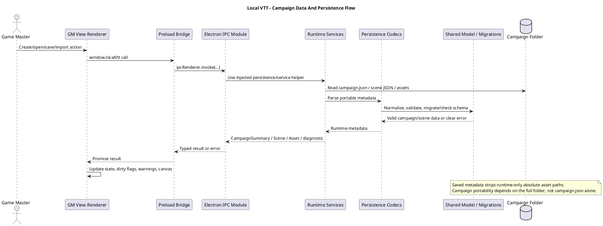
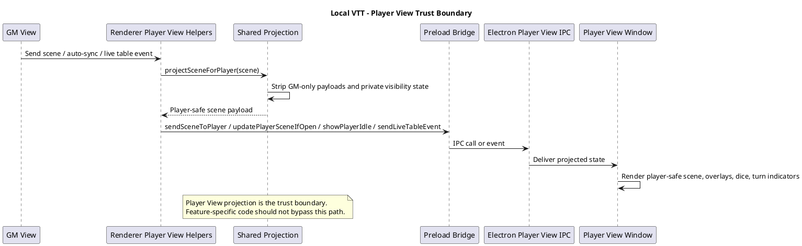
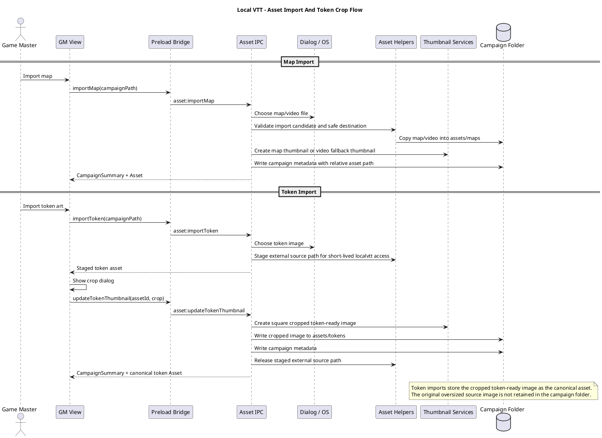
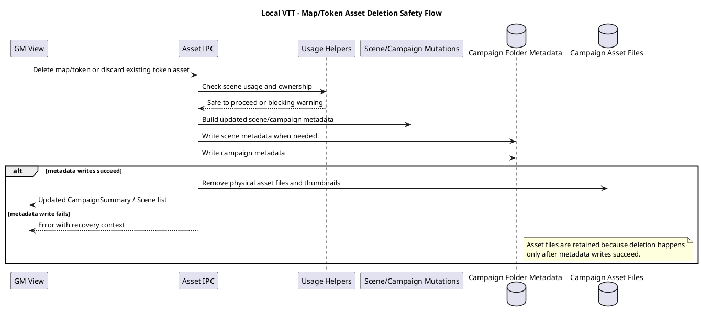
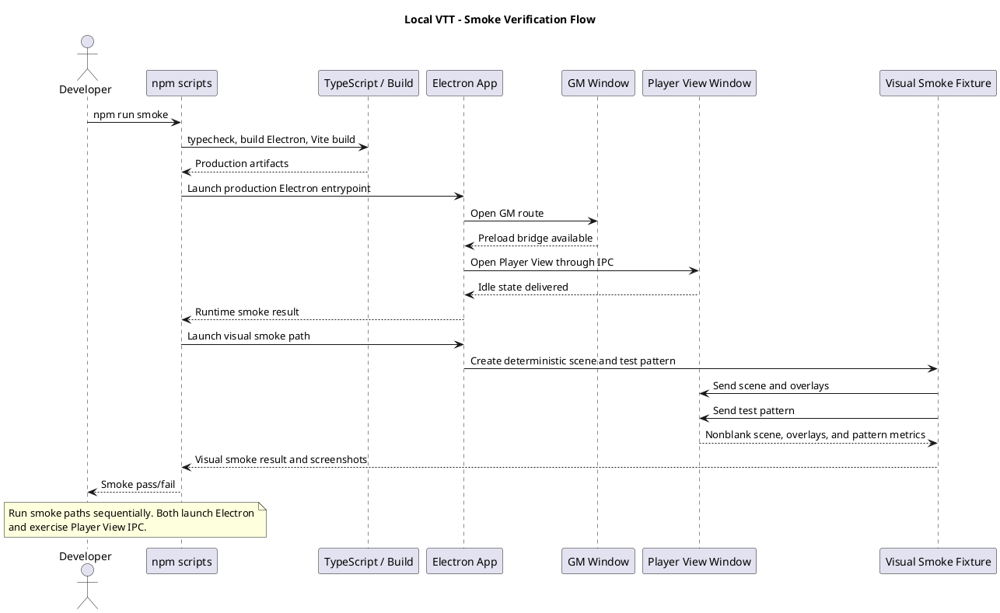

# Local VTT PlantUML Diagrams

These versions use the C4-PlantUML standard library. Most online PlantUML renderers can load the `!includeurl` references directly; if one blocks remote includes, paste the referenced C4-PlantUML file contents into the diagram first.

Architecture baseline: Local VTT `0.1.15` release-prep branch. The package metadata may still report the previous release until release metadata is updated.

## System Context

```plantuml
@startuml
!includeurl https://raw.githubusercontent.com/plantuml-stdlib/C4-PlantUML/master/C4_Context.puml

title Local VTT - System Context

Person(gm, "Game Master", "Creates and runs local tabletop scenes from the private GM View.")
Person(players, "Players", "View the projected battle map on a TV, monitor, or projector.")

System_Boundary(localMachine, "GM's Local Computer") {
  System(localVtt, "Local VTT", "Local-first desktop virtual tabletop for in-person RPG sessions.")
  System_Ext(desktopOs, "Desktop OS", "Windowing, display enumeration, file dialogs, fullscreen, shell integration, and filesystem access.")
  System_Ext(campaignFolder, "Portable Campaign Folder", "campaign.json, scene JSON, imported assets, thumbnails, and metadata backups.")
  System_Ext(sourceMedia, "Source Media Files", "Selected local maps, videos, and token art.")
}

Rel(gm, localVtt, "Runs sessions, edits scenes, imports assets, opens Player View")
Rel(players, localVtt, "Watch projected scenes and live table events")
Rel(localVtt, desktopOs, "Uses Electron/Chromium desktop APIs")
Rel(localVtt, campaignFolder, "Reads and writes local campaign data")
Rel(localVtt, sourceMedia, "Imports selected files into campaign-owned assets")

Lay_R(gm, localVtt)
Lay_R(localVtt, players)
Lay_D(localVtt, desktopOs)
Lay_D(localVtt, campaignFolder)
Lay_D(localVtt, sourceMedia)

SHOW_LEGEND()
@enduml
```

## Container Diagram

```plantuml
@startuml
!includeurl https://raw.githubusercontent.com/plantuml-stdlib/C4-PlantUML/master/C4_Container.puml

title Local VTT - Containers

Person(gm, "Game Master", "Controls the session from the GM window.")
Person(players, "Players", "See the projected Player View.")

System_Boundary(localVtt, "Local VTT Desktop App") {
  Container(gmRenderer, "GM View Renderer", "React, Canvas 2D, Three.js, Vite", "Private control UI for campaigns, scenes, tools, layers, dice, turn order, token library, and Player View controls.")
  Container(playerRenderer, "Player View Renderer", "React, Canvas 2D, Three.js", "Filtered, mostly non-interactive scene projection for external displays.")
  Container(preloadBridge, "Preload Bridge", "Electron contextBridge", "Typed window.localVtt API that exposes approved IPC operations only.")
  Container(electronMain, "Electron Main Process", "Electron, Node.js", "App lifecycle, secure windows, service registration, IPC coordination, protocol handling, and Player View window control.")
  Container(sharedModel, "Shared Model And Projection", "TypeScript", "Campaign and scene schemas, defaults, validation, normalization, migrations, and player-safe projection.")
}

ContainerDb(campaignFolder, "Campaign Folder", "JSON and media files", "Portable local folder with campaign metadata, scene files, assets, thumbnails, and backups.")
System_Ext(desktopOs, "Desktop OS", "Displays, dialogs, shell, fullscreen, filesystem, and media decoding.")

Rel(gm, gmRenderer, "Uses")
Rel(players, playerRenderer, "Views")
Rel(gmRenderer, preloadBridge, "Calls typed API", "window.localVtt")
Rel(playerRenderer, preloadBridge, "Subscribes to player state and live table events", "window.localVtt")
Rel(preloadBridge, electronMain, "Invokes handlers and receives events", "Electron IPC")
Rel(gmRenderer, sharedModel, "Uses schemas, defaults, normalization, and projection helpers")
Rel(playerRenderer, sharedModel, "Validates projected scenes and live table events")
Rel(electronMain, sharedModel, "Validates, normalizes, and serializes campaign data")
Rel(electronMain, campaignFolder, "Reads, writes, imports, backs up, prunes, and deletes")
Rel(electronMain, desktopOs, "Creates windows, opens dialogs, enumerates displays, opens folders")
Rel(electronMain, playerRenderer, "Sends projected scene state and live table events", "IPC")

Lay_R(gm, gmRenderer)
Lay_R(playerRenderer, players)
Lay_D(gmRenderer, preloadBridge)
Lay_D(playerRenderer, preloadBridge)
Lay_R(preloadBridge, electronMain)
Lay_D(electronMain, campaignFolder)
Lay_R(electronMain, desktopOs)

SHOW_LEGEND()
@enduml
```

## React/Electron MVC-Style Ownership

```plantuml
@startuml
!includeurl https://raw.githubusercontent.com/plantuml-stdlib/C4-PlantUML/master/C4_Component.puml

title Local VTT - React/Electron MVC-Style Ownership

Container_Boundary(app, "Local VTT Codebase") {
  Component(model, "Model / Domain", "src/shared, src/renderer/lib, focused Electron helpers", "Schemas, migrations, validation, projection, pure state transitions, persistence codecs, path/file rules.")
  Component(view, "View", "src/renderer/components, src/renderer/views", "React components and app-level view composition.")
  Component(controller, "Controller / Workflow Coordination", "src/renderer/hooks, Electron IPC modules", "State coordination, app workflows, async calls, IPC boundaries, and user action routing.")
  Component(platform, "Platform Adapters", "electron/", "Windows, dialogs, filesystem access, protocol handling, thumbnail/media integration, packaging/runtime checks.")
}

Rel(view, controller, "Dispatches typed user actions and consumes coordinated state")
Rel(controller, model, "Applies domain helpers and pure transitions")
Rel(controller, platform, "Calls preload/Electron services for native work")
Rel(platform, model, "Validates and serializes shared campaign/scene data")
Rel(model, view, "Provides types, defaults, view models, and projection results")

Lay_R(view, controller)
Lay_D(controller, model)
Lay_R(controller, platform)

SHOW_LEGEND()
@enduml
```

## Renderer Component Diagram

```plantuml
@startuml
!includeurl https://raw.githubusercontent.com/plantuml-stdlib/C4-PlantUML/master/C4_Component.puml

title Local VTT - Renderer Components

Container_Boundary(renderer, "src/renderer") {
  Component(routeBootstrap, "Renderer Bootstrap", "main.tsx", "Chooses GM or Player app from the hash route and installs renderer diagnostics.")
  Component(gmApp, "GM App", "React", "Composition root for workspace shell, campaign state, tools, dialogs, inspector, token library, dice, turn order, and Player View controls.")
  Component(playerApp, "Player App", "React", "Receives player state, manages projected scene display, idle/hold/blackout screens, dice overlays, and turn overlays.")
  Component(sceneCanvas, "Scene Canvas", "React + Canvas 2D", "Renders editable GM scenes and projected Player View scenes.")
  Component(gmHooks, "GM Workflow Hooks", "React hooks", "Campaign actions, dialog actions, maintenance state, workspace shell, tool selection, player menu, and scene selection.")
  Component(sceneInputControllers, "Scene Input Controllers", "components/scene/input", "Pointer, keyboard, hover, drag, token, drawing, fog, ruler, weather, and effect interaction helpers.")
  Component(canvasHooks, "Scene Canvas Hooks", "components/scene/hooks", "Pointer down/move/up, keyboard interaction, lifecycle resets, map readiness, render loop, context menus, token drops, polygon drafts.")
  Component(sceneOverlays, "Scene Overlays", "components/scene/overlays", "Player View turn/seat overlays, status strips, and scene tool status overlays.")
  Component(sceneMapSupport, "Scene Map Support", "components/scene/map", "Map calibration, video map elements, map readiness, and video-map viewport policy.")
  Component(toolComponents, "Tool And Layer Components", "React", "ToolsMenu, LayerPanel, layer rows, weather/effects/drawing/token panels, settings panels.")
  Component(playerViewLib, "Player View Library", "TypeScript", "Builds player-safe projections and sends scene, idle, dice, ping, laser, turn, and display events.")
  Component(domainLibs, "Renderer Domain Libraries", "TypeScript", "Campaign, scene, tokens, dice, map calibration, player display, workspace, assets, and UI-neutral helpers.")
}

Container(preloadBridge, "Preload Bridge", "Electron contextBridge", "Typed window.localVtt API.")
Container(sharedModel, "Shared Model And Projection", "TypeScript", "Schemas, defaults, validation, normalization, migrations, and player projection.")

Rel(routeBootstrap, gmApp, "Mounts for #/gm")
Rel(routeBootstrap, playerApp, "Mounts for #/player")
Rel(gmApp, gmHooks, "Composes workspace workflows")
Rel(gmApp, toolComponents, "Renders tools, layers, dialogs, sidebars, and panels")
Rel(gmApp, sceneCanvas, "Passes editable scene state, tools, selections, and callbacks")
Rel(playerApp, sceneCanvas, "Passes projected scene state in player mode")
Rel(sceneCanvas, canvasHooks, "Delegates input, lifecycle, readiness, and rendering mechanics")
Rel(sceneCanvas, sceneOverlays, "Renders player-facing and GM-facing canvas overlays")
Rel(sceneCanvas, sceneMapSupport, "Uses map/video readiness and calibration helpers")
Rel(canvasHooks, sceneInputControllers, "Apply explicit pointer and keyboard routing policies")
Rel(gmHooks, playerViewLib, "Sends and auto-syncs Player View state")
Rel(gmHooks, domainLibs, "Uses pure workflow helpers")
Rel(canvasHooks, domainLibs, "Uses scene, selection, geometry, and policy helpers")
Rel(sceneInputControllers, domainLibs, "Use scene and selection state transition helpers")
Rel(playerViewLib, sharedModel, "Calls projection and validation helpers")
Rel(gmApp, preloadBridge, "Creates, opens, saves, imports, and controls Player View")
Rel(playerApp, preloadBridge, "Receives player state and live table events")
Rel(domainLibs, sharedModel, "Uses shared types and defaults")

Lay_R(routeBootstrap, gmApp)
Lay_D(gmApp, sceneCanvas)
Lay_R(gmApp, gmHooks)
Lay_D(sceneCanvas, canvasHooks)
Lay_R(sceneCanvas, sceneOverlays)
Lay_D(canvasHooks, sceneInputControllers)
Lay_R(gmHooks, playerViewLib)
Lay_D(gmApp, preloadBridge)

SHOW_LEGEND()
@enduml
```

## Scene Canvas Pipeline

```plantuml
@startuml
!includeurl https://raw.githubusercontent.com/plantuml-stdlib/C4-PlantUML/master/C4_Component.puml

title Local VTT - Scene Canvas Pipeline

Container_Boundary(sceneCanvas, "Scene Canvas Area") {
  Component(sceneCanvasComponent, "SceneCanvas", "React", "Owns canvas composition, props, refs, and high-level scene mode.")
  Component(inputHooks, "Input Hooks", "components/scene/hooks", "Pointer, mouse, keyboard, wheel, token drop, context menu, and polygon draft orchestration.")
  Component(policyHelpers, "Input Controllers", "components/scene/input", "Pointer routing, selection clearing, hover updates, action builders, and scene item payloads.")
  Component(stateHelpers, "Scene State Helpers", "components/scene/state", "Drag commits, lifecycle reset actions, polygon draft commits, polygon draft state, and viewport actions.")
  Component(mapSupport, "Map And Video Support", "components/scene/map", "Map calibration controls, video map elements, map readiness, and viewport policy.")
  Component(overlays, "Canvas Overlays", "components/scene/overlays", "Player View turn/seat overlays, status strips, and tool status overlays.")
  Component(contextMenus, "Context Menus", "components/scene/context-menu", "Context menu rendering, opening state, target detection, and action routing.")
  Component(renderHook, "Render Loop Hook", "React hook", "Resize handling, animation frame scheduling, render plan preparation, and layer draw ordering.")
  Component(renderers, "Canvas Renderers", "Canvas 2D + Three.js snapshots", "Map, grid, fog, weather, effects, drawings, templates, tokens, measurements, live table overlays.")
  Component(assetHooks, "Asset And Media Hooks", "React hooks", "Image map loader, video map handlers, token image loader, local asset URLs, readiness, auto-fit.")
}

Container(sharedModel, "Scene Model", "TypeScript", "Scene, layers, drawings, effects, fog, weather, tokens, grid, and map transform.")
Container(playerView, "Player View", "React", "Receives projected non-GM scene state.")

Rel(sceneCanvasComponent, inputHooks, "Delegates browser event mechanics")
Rel(inputHooks, policyHelpers, "Applies explicit action/policy helpers")
Rel(inputHooks, stateHelpers, "Commits scene state changes")
Rel(sceneCanvasComponent, mapSupport, "Uses map calibration and video map support")
Rel(sceneCanvasComponent, overlays, "Renders overlay components")
Rel(sceneCanvasComponent, contextMenus, "Renders and routes context menus")
Rel(sceneCanvasComponent, renderHook, "Delegates drawing lifecycle")
Rel(renderHook, renderers, "Draws ordered visual layers")
Rel(sceneCanvasComponent, assetHooks, "Loads image/video/token assets and readiness state")
Rel(policyHelpers, sharedModel, "Produces next scene states and selection actions")
Rel(stateHelpers, sharedModel, "Produces reusable scene state transitions")
Rel(renderers, sharedModel, "Consumes renderable scene state")
Rel(playerView, sceneCanvasComponent, "Uses player mode with projected scene")

Lay_D(sceneCanvasComponent, inputHooks)
Lay_D(inputHooks, policyHelpers)
Lay_R(inputHooks, stateHelpers)
Lay_R(sceneCanvasComponent, renderHook)
Lay_D(renderHook, renderers)
Lay_R(sceneCanvasComponent, assetHooks)

SHOW_LEGEND()
@enduml
```

## 3D Dice And Effect Rendering

```plantuml
@startuml
!includeurl https://raw.githubusercontent.com/plantuml-stdlib/C4-PlantUML/master/C4_Component.puml

title Local VTT - 3D Dice And Effect Rendering

Container_Boundary(renderer, "src/renderer") {
  Component(sceneCanvas, "SceneCanvas", "React + Canvas 2D", "Primary map-bound composition surface for GM View and Player View.")
  Component(diceOverlay, "DiceRollOverlay", "React + Three.js + Rapier3D", "Renders 3D dice panels and scene rolls. Scene rolls initialize Rapier physics and publish resolved live-table results.")
  Component(weatherRenderers, "Weather Renderers", "Three.js WebGLRenderer", "Rain, snow, sand, and fog renderers draw WebGL particles/meshes, then composite the renderer canvas into Canvas 2D.")
  Component(environmentEffects, "Environment Effect Renderers", "Three.js shader runtimes", "Water, smoke, fog, lava, fire, lightning, arcane, chaos, void, nature, radiant, force-field, shockwave, and distortion effects.")
  Component(templateEffects, "Template Effect Assets", "Transient Three.js renderers", "Creates cached template visuals for spell and area drawings before Canvas 2D composition.")
}

Component(threeJs, "Three.js", "WebGL rendering library", "Meshes, particles, shader materials, cameras, lights, textures, and shared dice renderer.")
Component(rapier, "Rapier3D", "Physics engine", "Rigid bodies, colliders, gravity, bounces, settling, and resolved face orientation for scene-style dice rolls.")
Component(canvas2d, "Canvas 2D Context", "Browser rendering API", "Final map-bound composition target for maps, grids, fog, effects, drawings, tokens, measurements, and live overlays.")

Rel(sceneCanvas, diceOverlay, "Shows scene dice rolls and resolved live table events")
Rel(sceneCanvas, weatherRenderers, "Calls weather drawing during render loop")
Rel(sceneCanvas, environmentEffects, "Draws localized animated effects")
Rel(sceneCanvas, templateEffects, "Uses cached drawing/template visuals")
Rel(diceOverlay, threeJs, "Creates dice scene, camera, lights, dice meshes, face labels, highlights, and renderer")
Rel(diceOverlay, rapier, "Uses physics for scene-roll mode")
Rel(weatherRenderers, threeJs, "Creates WebGL renderers, orthographic cameras, particles, meshes, and shader materials")
Rel(environmentEffects, threeJs, "Creates effect scenes, cameras, shader materials, uniforms, and animated render targets")
Rel(templateEffects, threeJs, "Creates transient renderers, scenes, cameras, and texture snapshots")
Rel(weatherRenderers, canvas2d, "Draws renderer.domElement into the scene canvas")
Rel(environmentEffects, canvas2d, "Draws renderer.domElement into the scene canvas")
Rel(templateEffects, canvas2d, "Supplies cached visuals for drawing-layer composition")

Lay_D(sceneCanvas, weatherRenderers)
Lay_D(sceneCanvas, environmentEffects)
Lay_D(sceneCanvas, templateEffects)
Lay_R(sceneCanvas, diceOverlay)
Lay_D(diceOverlay, threeJs)
Lay_R(diceOverlay, rapier)
Lay_D(weatherRenderers, canvas2d)
Lay_D(environmentEffects, canvas2d)

SHOW_LEGEND()
@enduml
```

## Electron Main Components

```plantuml
@startuml
!includeurl https://raw.githubusercontent.com/plantuml-stdlib/C4-PlantUML/master/C4_Component.puml

title Local VTT - Electron Main Components

Container_Boundary(electron, "electron/") {
  Component(mainProcess, "Main Process", "main.ts", "Application lifecycle, secure BrowserWindow creation, service registration, Player View window control, and unsaved-close handling.")
  Component(preload, "Preload API", "preload.ts", "contextBridge wrapper around approved ipcRenderer.invoke, ipcRenderer.send, and event subscriptions.")
  Component(windowFactory, "Window Factory", "appWindowFactory.ts", "Creates GM and Player windows with the expected security settings and runtime options.")
  Component(ipcModules, "IPC Modules", "campaignIpc, sceneIpc, mapAssetIpc, tokenAssetIpc, assetMaintenanceIpc, playerViewIpc", "Register focused handlers for campaign, scene, asset, maintenance, and Player View workflows.")
  Component(runtimeServices, "Runtime Services", "campaignRuntimeServices.ts", "Composes persistence, sessions, protocol paths, backups, and asset services for IPC modules.")
  Component(assetProtocol, "Asset Protocol", "assetProtocol.ts", "Serves registered campaign asset paths and short-lived staged token source paths through localvtt://asset.")
  Component(thumbnailServices, "Thumbnail Services", "thumbnailServices.ts, thumbnailRegeneration.ts, videoThumbnailFallback.ts", "Creates and repairs image, video, map, token, and fallback thumbnails.")
  Component(metadataServices, "Metadata Services", "persistenceCodecs, metadataBackup*, campaignHealth, metadataErrors", "Portable JSON persistence, backups, restore previews, health diagnostics, and recovery messages.")
  Component(assetHelpers, "Asset Helpers", "assetFiles, assetImport*, map/token asset helpers", "Safe paths, import validation, staged token imports, map replacement tokens, pruning, deletion, and write-before-delete workflows.")
}

ContainerDb(campaignFolder, "Campaign Folder", "JSON and media files", "campaign.json, scenes, assets, thumbnails, and metadata backups.")
Container(sharedModel, "Shared Model", "TypeScript", "Validation, normalization, defaults, schema migrations, and player projection types.")
System_Ext(desktopOs, "Desktop OS", "Filesystem, dialogs, shell, displays, windows, fullscreen, and media decoding.")
Container(gmRenderer, "GM View Renderer", "React", "Private GM UI.")
Container(playerRenderer, "Player View Renderer", "React", "Projected player UI.")

Rel(gmRenderer, preload, "Calls window.localVtt API")
Rel(playerRenderer, preload, "Subscribes and sends live table events")
Rel(preload, ipcModules, "Invokes IPC handlers")
Rel(mainProcess, windowFactory, "Creates secure windows")
Rel(mainProcess, runtimeServices, "Builds injectable runtime dependencies")
Rel(mainProcess, ipcModules, "Registers handlers")
Rel(ipcModules, runtimeServices, "Use injected persistence, sessions, protocol, and asset services")
Rel(runtimeServices, metadataServices, "Reads, writes, backs up, restores, and diagnoses")
Rel(runtimeServices, assetProtocol, "Registers allowed asset paths")
Rel(ipcModules, thumbnailServices, "Create/repair thumbnails")
Rel(ipcModules, assetHelpers, "Validate paths, import assets, replace maps, stage token imports, prune/delete")
Rel(metadataServices, sharedModel, "Normalize, validate, and serialize")
Rel(runtimeServices, campaignFolder, "Read/write campaign-owned files")
Rel(mainProcess, desktopOs, "Use native dialogs, shell, displays, and windows")
Rel(mainProcess, playerRenderer, "Sends projected player state and live table events")

Lay_D(gmRenderer, preload)
Lay_D(playerRenderer, preload)
Lay_R(preload, ipcModules)
Lay_D(mainProcess, runtimeServices)
Lay_R(runtimeServices, campaignFolder)
Lay_R(mainProcess, desktopOs)

SHOW_LEGEND()
@enduml
```

## Campaign Data And Persistence Flow

```plantuml
@startuml
title Local VTT - Campaign Data And Persistence Flow

actor "Game Master" as GM
participant "GM View Renderer" as Renderer
participant "Preload Bridge" as Preload
participant "Electron IPC Module" as IPC
participant "Runtime Services" as Services
participant "Persistence Codecs" as Codecs
participant "Shared Model / Migrations" as Shared
database "Campaign Folder" as Folder

GM -> Renderer: Create/open/save/import action
Renderer -> Preload: window.localVtt call
Preload -> IPC: ipcRenderer.invoke(...)
IPC -> Services: Use injected persistence/service helper
Services -> Folder: Read campaign.json / scene JSON / assets
Services -> Codecs: Parse portable metadata
Codecs -> Shared: Normalize, validate, migrate/check schema
Shared --> Codecs: Valid campaign/scene data or clear error
Codecs --> Services: Runtime metadata
Services --> IPC: CampaignSummary / Scene / Asset / diagnostic
IPC --> Preload: Typed result or error
Preload --> Renderer: Promise result
Renderer -> Renderer: Update state, dirty flags, warnings, canvas

note over Folder
Saved metadata strips runtime-only absolute asset paths.
Campaign portability depends on the full folder, not campaign.json alone.
end note
@enduml
```

## Player View Trust Boundary

```plantuml
@startuml
title Local VTT - Player View Trust Boundary

participant "GM View" as GM
participant "Renderer Player View Helpers" as Helpers
participant "Shared Projection" as Projection
participant "Preload Bridge" as Preload
participant "Electron Player View IPC" as Main
participant "Player View Window" as Player

GM -> Helpers: Send scene / auto-sync / live table event
Helpers -> Projection: projectSceneForPlayer(scene)
Projection -> Projection: Strip GM-only payloads and private visibility state
Projection --> Helpers: Player-safe scene payload
Helpers -> Preload: sendSceneToPlayer / updatePlayerSceneIfOpen / showPlayerIdle / sendLiveTableEvent
Preload -> Main: IPC call or event
Main -> Player: Deliver projected state
Player -> Player: Render player-safe scene, overlays, dice, turn indicators

note over Projection
Player View projection is the trust boundary.
Feature-specific code should not bypass this path.
end note
@enduml
```

## Asset Import And Token Crop Flow

```plantuml
@startuml
title Local VTT - Asset Import And Token Crop Flow

actor "Game Master" as GM
participant "GM View" as Renderer
participant "Preload Bridge" as Preload
participant "Asset IPC" as IPC
participant "Dialog / OS" as OS
participant "Asset Helpers" as Helpers
participant "Thumbnail Services" as Thumbs
database "Campaign Folder" as Folder

== Map Import ==
GM -> Renderer: Import map
Renderer -> Preload: importMap(campaignPath)
Preload -> IPC: asset:importMap
IPC -> OS: Choose map/video file
IPC -> Helpers: Validate import candidate and safe destination
Helpers -> Folder: Copy map/video into assets/maps
IPC -> Thumbs: Create map thumbnail or video fallback thumbnail
IPC -> Folder: Write campaign metadata with relative asset path
IPC --> Renderer: CampaignSummary + Asset

== Token Import ==
GM -> Renderer: Import token art
Renderer -> Preload: importToken(campaignPath)
Preload -> IPC: asset:importToken
IPC -> OS: Choose token image
IPC -> Helpers: Stage external source path for short-lived localvtt access
IPC --> Renderer: Staged token asset
Renderer -> Renderer: Show crop dialog
Renderer -> Preload: updateTokenThumbnail(assetId, crop)
Preload -> IPC: asset:updateTokenThumbnail
IPC -> Thumbs: Create square cropped token-ready image
IPC -> Folder: Write cropped image to assets/tokens
IPC -> Folder: Write campaign metadata
IPC -> Helpers: Release staged external source path
IPC --> Renderer: CampaignSummary + canonical token Asset

note over Folder
Token imports store the cropped token-ready image as the canonical asset.
The original oversized source image is not retained in the campaign folder.
end note
@enduml
```

## Asset Deletion Safety Flow

```plantuml
@startuml
title Local VTT - Map/Token Asset Deletion Safety Flow

participant "GM View" as Renderer
participant "Asset IPC" as IPC
participant "Usage Helpers" as Usage
participant "Scene/Campaign Mutations" as Mutations
database "Campaign Folder Metadata" as Metadata
database "Campaign Asset Files" as Files

Renderer -> IPC: Delete map/token or discard existing token asset
IPC -> Usage: Check scene usage and ownership
Usage --> IPC: Safe to proceed or blocking warning
IPC -> Mutations: Build updated scene/campaign metadata
IPC -> Metadata: Write scene metadata when needed
IPC -> Metadata: Write campaign metadata
alt metadata writes succeed
  IPC -> Files: Remove physical asset files and thumbnails
  IPC --> Renderer: Updated CampaignSummary / Scene list
else metadata write fails
  IPC --> Renderer: Error with recovery context
  note over Files
  Asset files are retained because deletion happens
  only after metadata writes succeed.
  end note
end
@enduml
```

## Smoke Verification Flow

```plantuml
@startuml
title Local VTT - Smoke Verification Flow

actor "Developer" as Dev
participant "npm scripts" as Npm
participant "TypeScript / Build" as Build
participant "Electron App" as App
participant "GM Window" as GM
participant "Player View Window" as Player
participant "Visual Smoke Fixture" as Visual

Dev -> Npm: npm run smoke
Npm -> Build: typecheck, build Electron, Vite build
Build --> Npm: Production artifacts
Npm -> App: Launch production Electron entrypoint
App -> GM: Open GM route
GM --> App: Preload bridge available
App -> Player: Open Player View through IPC
Player --> App: Idle state delivered
App --> Npm: Runtime smoke result
Npm -> App: Launch visual smoke path
App -> Visual: Create deterministic scene and test pattern
Visual -> Player: Send scene and overlays
Visual -> Player: Send test pattern
Player --> Visual: Nonblank scene, overlays, and pattern metrics
Visual --> Npm: Visual smoke result and screenshots
Npm --> Dev: Smoke pass/fail

note over Dev,Npm
Run smoke paths sequentially. Both launch Electron
and exercise Player View IPC.
end note
@enduml
```
